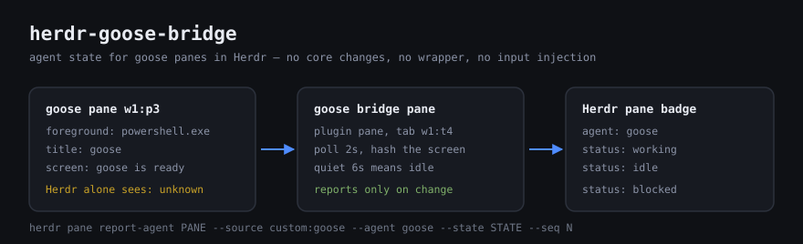

# goose-bridge — a Herdr plugin that gives goose panes real agent state

<p align="center">
  
</p>

Herdr cannot detect goose on its own: goose is a line-mode CLI, so on Windows the
foreground process of a goose pane is still `powershell.exe` (verified — see
[docs/FINDINGS.md](docs/FINDINGS.md)). Herdr's own "supported agents" list therefore has no
goose entry, and goose panes stay `unknown`.

This plugin closes that gap without touching either program: it watches panes,
recognises goose, and reports `idle` / `working` / `blocked` through the supported
`herdr pane report-agent` API. It never sends input to a pane.

```
pane list before:  {"pane_id":"w1:p3","agent_status":"unknown", ...}
pane list after:   {"pane_id":"w1:p3","agent":"goose","agent_status":"done", ...}
```

## How it recognises goose

1. **Foreground process** (`herdr pane process-info`): `name` / `argv0` / `argv[0]`
   basename matched against `GOOSE_BRIDGE_PROC`. Catches full-screen agents.
2. **Title + screen** (the path that actually works for goose today): the pane
   title matches `GOOSE_BRIDGE_TITLE` (`goose` → `🪿 goose`) **and** the screen
   contains goose's UI markers (`goose is ready`, `Enter to send`, `(O)>` …).
   Two factors on purpose: when goose exits, its title may linger but the screen
   goes back to a shell prompt, so the pane gets released instead of lying.
3. Pane-record fields, optional cmdline match (`GOOSE_BRIDGE_MATCH_CMDLINE=1`),
   optional scan-every-pane (`GOOSE_BRIDGE_SCREEN=1`).

State is inferred from the pane output: changing output = `working`, quiet for
`GOOSE_BRIDGE_IDLE_AFTER_MS` = `idle`, and a prompt-looking tail
(`allow?`, `approve`, `permission`, `[y/N]`, `press enter` …) = `blocked`.

## Layout

| File | Role |
| --- | --- |
| `herdr-plugin.toml` | manifest: 1 startup hook, 1 pane entrypoint, 3 actions |
| `bin/autostart.js` | startup hook — opens the watcher pane, then exits (idempotent) |
| `bin/bridge.js` | the long-lived watcher, runs *as a plugin pane* |
| `bin/release-all.js` | release goose authority on every pane (cleanup) |
| `docs/FINDINGS.md` | every claim above, with the command and output that proved it |
| `scripts/verify.mjs` | static checks for the invariants above (`npm run verify`) |

Herdr startup hooks are one-shot and explicitly not meant for daemons, so the
hook only opens the pane; `[[panes]] watcher` is the daemon.

## Requirements

- Herdr ≥ 0.9.0 (built and verified against 0.9.0, protocol 22)
- Node ≥ 22 (verified on v24; the plugin calls the `herdr` binary through
  `HERDR_BIN_PATH`, so no herdr libraries are needed)

## Install / run

Replace the path with this checkout.

```powershell
herdr plugin link C:\path\to\herdr-goose-bridge
herdr plugin list                        # → goose.bridge enabled

# start it now (the startup hook only runs on the next herdr server start)
node C:\path\to\herdr-goose-bridge\bin\autostart.js
# or from the UI: plugin action "goose bridge: open the watcher tab"
# or directly:
herdr plugin pane open --plugin goose.bridge --entrypoint watcher --placement tab --no-focus
```

The watcher then lives in a tab titled **goose bridge** and prints its state
transitions there. `herdr plugin log list` stays empty, so read that pane.

Dry run / cleanup:

```powershell
node bin\bridge.js --dry-run
node bin\release-all.js
```

Static checks (no herdr, no network, no dependencies):

```powershell
npm run check     # node --check on every script + the invariant checks
```

## Configuration (environment)

Set these on the watcher pane (or in the shell that starts it).

| Var | Default | Meaning |
| --- | --- | --- |
| `GOOSE_BRIDGE_POLL_MS` | `2000` | poll interval |
| `GOOSE_BRIDGE_IDLE_AFTER_MS` | `6000` | quiet time before reporting `idle` |
| `GOOSE_BRIDGE_LINES` | `30` | screen lines read per poll |
| `GOOSE_BRIDGE_SOURCE` | `custom:goose` | `--source`; keep stable, it keys the seq watermark |
| `GOOSE_BRIDGE_AGENT` | `goose` | `--agent` label |
| `GOOSE_BRIDGE_PROC` | `^(goose\|goose\.exe\|goosed\|goosed\.exe)$` | basename regex for the foreground program |
| `GOOSE_BRIDGE_TITLE` | `goose` | pane-title regex (the working signal) |
| `GOOSE_BRIDGE_SCREEN_PATTERN` | `goose is ready\|Enter to send\|Ctrl\+J newline\|\( ?O\)>` | markers required for a title-only match |
| `GOOSE_BRIDGE_SCREEN` | `0` | `1` = read every pane's screen, not just title matches |
| `GOOSE_BRIDGE_MATCH_CMDLINE` | `0` | `1` = also match `process-info` cmdlines (wrapper launches) |
| `GOOSE_BRIDGE_PANES` | *(empty)* | force pane ids (debugging) |
| `GOOSE_BRIDGE_BLOCKED` | built-in set | `\|`-separated regexes that mean "waiting for input" |
| `GOOSE_BRIDGE_BLOCKED_DEBOUNCE_MS` | `1500` | don't call a prompt `blocked` too early |
| `GOOSE_BRIDGE_PANE_FIELDS` | `foreground_command,foreground_process,command,process,program,executable,argv0` | legacy pane-record fallback |

## Known limitations

- **State is heuristic.** `working` / `idle` come from an output hash + quiet
  timer; `blocked` is regex guessing. If goose's TUI keeps redrawing during a
  turn, `idle` may never trigger.
- **No native badge.** Plugin v1 excludes runtime action registration and native
  non-terminal UI, so this cannot become a first-class herdr integration with a
  session manifest. It is a bridge, not an integration.
- **`--seq` is sticky.** herdr ignores non-increasing `--seq` per
  (pane, source, agent) and `release-agent` does not reset it, hence the
  timestamp-based sequence. Never reuse `GOOSE_BRIDGE_SOURCE` for another agent.
- **`release-agent` does not clear the pane's displayed agent name.** Verified:
  the last known `agent` / `agent_status` stay on the pane, and there is no CLI
  command to clear them (`clear-agent-authority` is socket-only).
- **Windows multi-machine SSH is not covered** by anything here.
- Not a `herdr integration install` target: goose has no herdr screen manifest,
  which would be core work, not plugin work.

## Origin

Written against the herdr plugin API as documented at
[herdr.dev/docs/plugins](https://herdr.dev/docs/plugins/) and against the socket
schema dumped locally with `herdr api schema --json`. Every claim in this README
was tested on a live herdr 0.9.0 session; `docs/FINDINGS.md` records the command
and the output behind each one, including the ones that turned out to be false
starts.

## License

[MIT](LICENSE)
